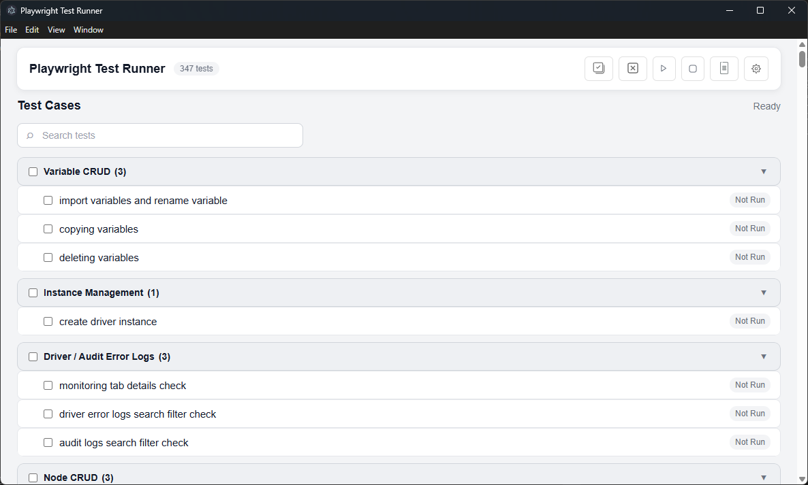
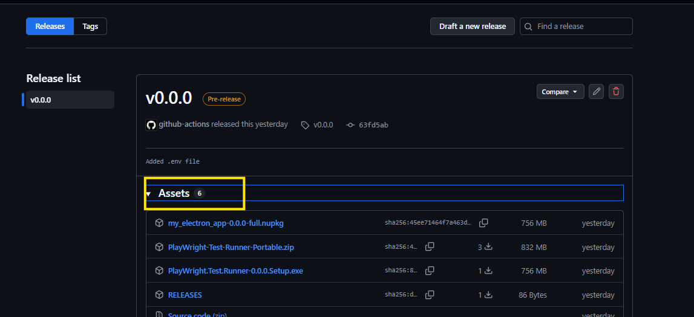
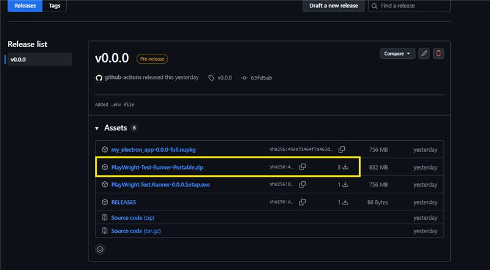
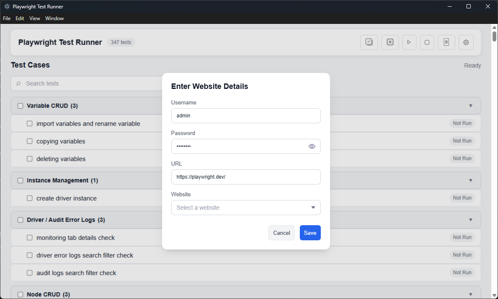

# Playwright Test Runner

An Electron-based desktop application for executing automated tests using [Playwright](https://playwright.dev/).
The application provides a simple interface to configure a website, user credentials, select a test case, execute the test, and view the generated test report.

## Features

- Electron-based desktop application
- Playwright-powered automated test execution
- Website configuration
- Username and password configuration
- Website selection
- Test case selection and execution
- Test report generation and viewing
- Simple graphical user interface

## Prerequisites

Before using the application, make sure you have:

- A Windows system
- The Electron Test Runner .zip package
- Valid website credentials
- Access to the website you want to test

## Installation

### 1. Download the Application

1. Go to the repository's [Releases](https://github.com/kiwiKaptain/electron-test-runner/releases) tab.
2. Open the required release, for example v0.0.0.
3. Expand the Assets section.
4. Download the available .zip file.

### 2. Extract the Application

1. Navigate to the downloaded .zip file.
2. Extract the contents to a folder of your choice.
3. Open the extracted folder.

### 3. Launch the Application

Locate the .exe file in the extracted folder and double-click it to launch the Playwright Test Runner.

## Configuration

After launching the application, configure the required details:

- Go to Settings Modal
- Enter the Website URL.
- Enter the Username.
- Enter the Password.
- Select the required Website from the available website options.
- Click Save to save the configuration.

Note: Use valid credentials with the appropriate permissions for the website being tested.

## Running a Test

Once the application has been configured:

1. Select or configure the required test case.
2. Click Run to start the test execution.
3. The application uses Playwright to execute the automated test.
4. Wait for the test execution to complete.

## Viewing the Test Report

After the test execution has finished:

1. Click View Report.
2. The generated test report will open.
3. Review the test execution results, including the status of the executed tests.
